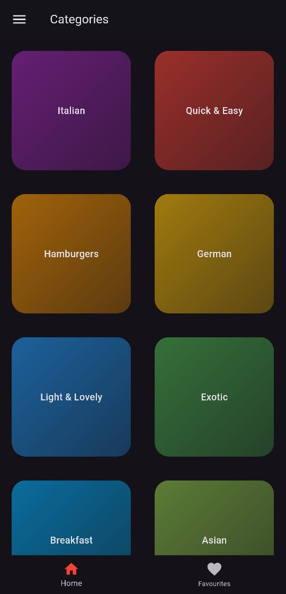
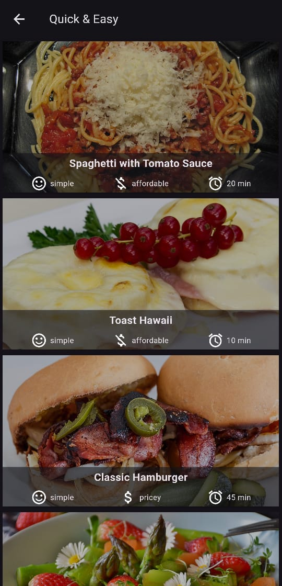
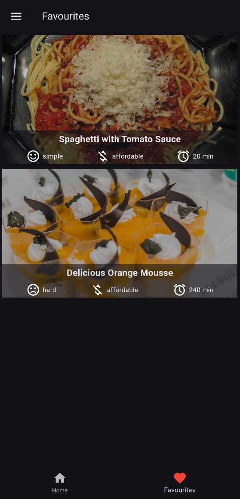
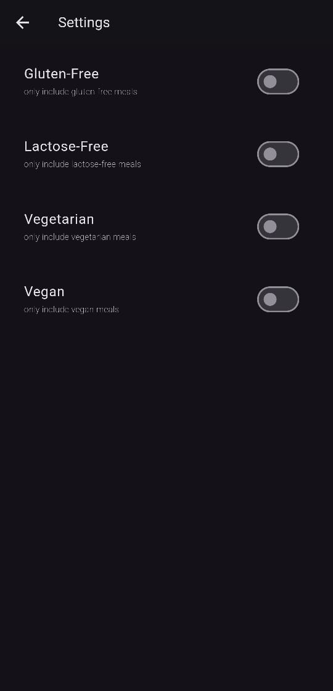
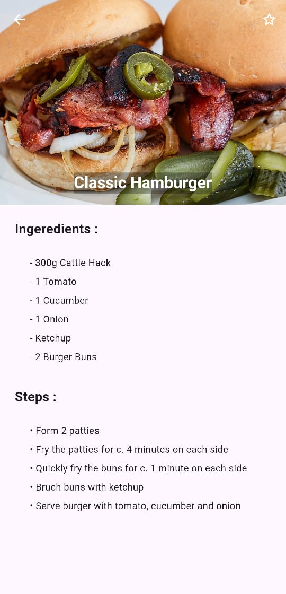

# Recipe App

## Overview

The Meal Preview App allows users to explore various recipes based on their chosen categories. Users can view meal details, including title, image, preparation time, cost, and effort needed to make the meal. The app also features a favorites section, filtering options, and a responsive design optimized for various device sizes. Additionally, it supports both light and dark themes for a customizable user experience.

## Features

- **Meal Categories**: Users can select meal categories to view relevant recipes.
- **Meal Details**: Click on a meal to view the title, steps, and ingredients.
- **Favorite Meals**: Add meals to the favorites section using a star button.
- **Filters**: Use the drawer to filter meals by options like vegan, vegetarian, lactose-free, and gluten-free.
- **Responsive UI**: The app adapts to different device sizes.
- **Animation**: Smooth transitions and animations for a better user experience.
- **Internet Image Loading**: Displays meal images from the internet, with error handling for no internet connection.
- **Portrait Mode Lock**: The app is locked to portrait orientation.
- **Light/Dark Theme Support**: Automatically adjusts between light and dark themes based on system preferences.

## Screenshots

  
  

*Home Screen displaying meal categories and Meal Detail Screen showing title, cost, and effort*

  
  

*Favorites Screen displaying favorite meals and Filters Controller for meal options*

*Meal Detail Screen showing image, title, steps, and ingredients*